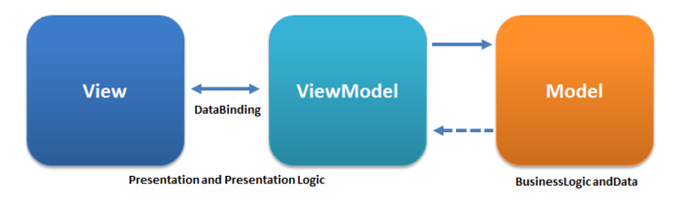
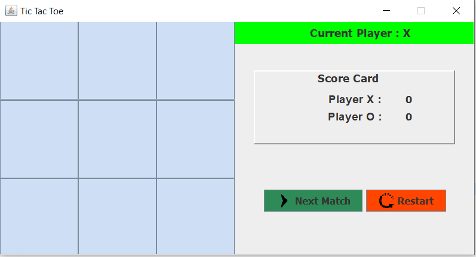
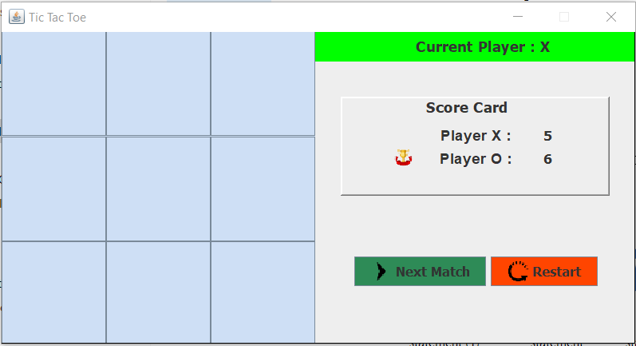

# Tic-Tac-Toe
<h4>About Tic Tac Toe </h4>- Tic-tac-toe, noughts and crosses or Xs and Os is a two players Game, X and O, who take turns marking the spaces in a 3×3 grid. The player who succeeds in placing three of their marks in a horizontal, vertical, or diagonal row is the winner.

<h2>Swing (GUI) </h2>
Swing is a GUI widget toolkit for Java. It is part of Oracle's Java Foundation Classes (JFC) – an API for providing a graphical user interface (GUI) for Java programs.

 <h2> AWT(Abstract Window Toolkit) </h2>
It is a platform dependent API for creating Graphical User Interface (GUI) for java programs.

 <h2> Model–view </h2>

<h4> Model </h4>
Model refers either to a domain model, which represents real state content (an object-oriented approach), or to the data access layer, which represents content (a data-centric approach).
<h4>View</h4>
The view is the structure, layout, and appearance of what a user sees on the screen. It displays a representation of the model and receives the user's interaction with the view (clicks, keyboard, gestures, etc.), and it forwards the handling of these to the view model via the data binding (properties, event callbacks, etc.) that is defined to link the view and view model.

<h5>For more</h5> https://en.wikipedia.org/wiki/Model%E2%80%93view%E2%80%93viewmodel

 <h2> Features  </h2>
    1. 3x3 Grid Board  
    2. Current Player Chance Indicator  
    3. Score Card For Both Player (Player X and Player O)  
    4. Next Match Button (To Start A Fresh New Match)  
    5. Restart Button (To Reset the game and the Score Card to Initial)  
    6. Win / Draw Indicator   
    7. Winning Player Indication  

 <h2> GUI </h2>

